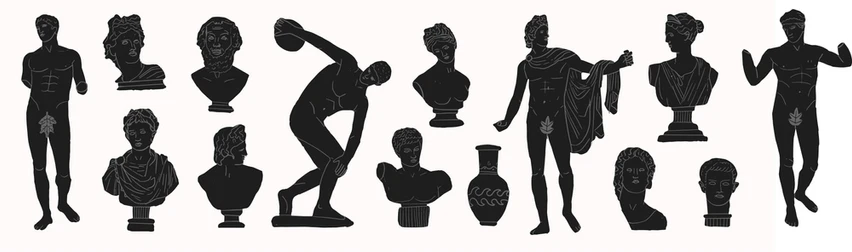

# Virtual Museum: An Interactive Companion to Exhibits

**[Try the app here](https://museum-app-515787033825.europe-central2.run.app)**

## About the App and Its Purpose

This project is a virtual museum companion that lets visitors ask questions instead of reading long labels. After you pick an exhibit, you can type a question and get a short, clear answer in Lithuanian or English. When a single item isn’t enough, the guide compares related exhibits and can show a simple timeline to place objects in context. 

The main objective of the project is:

> **Make collections easier to explore for people who don't want to read**

In a museum, visitors could open an item by scanning a QR code next to it or by finding it in a gallery view, just like in this prototype.

## How It Works

The app opens with a gallery where you can select an exhibit from the six available in this prototype and switch between Lithuanian and English. Once an item is chosen, you can ask questions and receive answers. Token usage and cost are displayed for each reply, and chats can be exported as JSON or TXT. Beyond direct Q&A, the app can also place exhibits on a timeline or explain how the guide works.

The app can also answer questions that involve other available exhibits in relation to the one you selected. This is not a general search across the entire collection but a way to surface related items that provide additional context. For example, if you ask “What other items were used in crimes?” while viewing a counterfeit coin die, the guide may mention other weapons or tools, but the conversation remains centered on the die you originally selected.

### Technical details

When you ask a question, the assistant first tries to answer from the selected exhibit’s available description, while also relying on the model’s general knowledge if needed. If the answer requires information from multiple artifacts, it switches to a Retrieval-Augmented Generation (RAG) flow: your query and some information about the item you have selected is embedded with OpenAI, matched against a Pinecone index of exhibit chunks, and the most relevant results are used to answer your question.

## Next Steps

It would be good to add user logging not only for monitoring but also for security purposes, such as tracking API usage. This could be paired with administrative functionality, where new JSON files and images could be uploaded directly, and those items would automatically appear in the gallery without rerunning the ingestion script.

The app could be made more intuitive by allowing users to ask about any item without requiring the questions to be linked to the selected exhibit. It would also be useful to add an ability to shift focus naturally as the conversation drifts toward other artifacts.

An open point is how much the assistant should rely on its general knowledge. Right now, it may answer from either the exhibit description or the LLM’s background knowledge, but this balance is not strictly controlled.

So far, the app has only been tested manually, and no hallucinations have been observed. The answers are grounded in the provided documentation, but a more systematic evaluation would be helpful. The best approach could be to build a test set of questions and use another LLM to judge whether the responses are logical.

Each item was also chunked into 600-token segments to create the vector base, which may not be necessary and should be revisited.

## Limitations

The main practical limitation is the availability of digitized documents. Some museums may not have digital versions of their collections, and creating them could be costly. However, if digitized files are available, building and expanding this type of system would be straightforward.

At the moment, the retrieval query for the RAG system consists of the user’s question combined with four fields of the selected item’s metadata. With only a handful of exhibits, it is easy for the RAG to find the right documents, but scaling to hundreds or more items would require experimenting with the amount of included metadata about the selected item. 

## Example Interaction

🧑 What was this used for?

🤖 The axe found in the territory of Vilnius Lower Castle was likely used for both practical work and as a weapon in battle. Its design suggests it could serve as a versatile tool, suitable for everyday tasks as well as combat. Researchers continue to debate the specific purposes of different types of axes, but this particular axe is categorized as a universal type, which may have been employed in a variety of functions during the 15th century.

🧑 Are there any other weapons in the exhibit?

🤖 Yes, there are other weapons in the exhibit, specifically a combat knife blade tip that was discovered in the territory of Vilnius Lower Castle. This fragment is part of a collection that includes intact combat knives and their components. These types of knives were used in Europe from the late 14th century to the 17th century and served as an alternative weapon for peasants and townspeople when carrying swords was prohibited.
